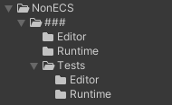
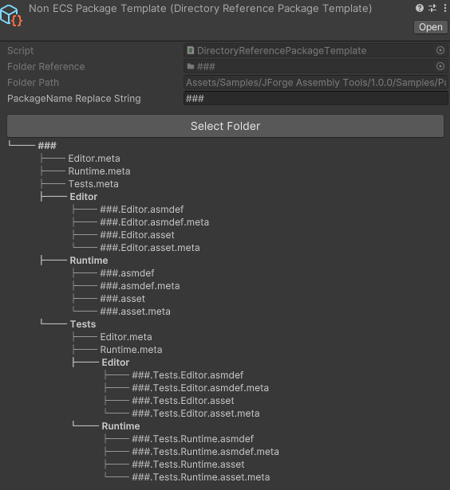
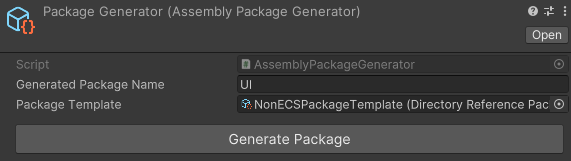

# Assembly Package Generator
## Summary
The Assembly Package Generator is a tool to generate feature packages from a template folder structure with assemblies and references.
## Using
* Set up a template folder structure with assemblies and references.
  * The template folder structure can use regular Assemblies, [Inherited Assembly Generator](Documentation~/InheritedAssemblyGenerator.md)s and any other project files.
  * Name files and folders with a replacement string e.g. "#" to later be replaced with a feature name.

* Create a **DirectoryReferencePackageTemplate** scriptable object in the project folder from **Create->JForge->DirectoryReferencePackageTemplate**
  * Click the "Select folder" button to set the correct template folder.
  * Set the replacement string

* Create a AssemblyPackageGenerator **Create->JForge->AssemblyPackageGenerator** in the parent folder of where you want to create the package
  * Set the feature name and target template
* Click the "Generate" button to create the package.

## Advanced
* If you want to create new types of custom templates akin to **DirectoryReferencePackageTemplate** you can inherit the **PackageTemplate** scriptable object.
* If you want to support custom assets being copied that requires post processing you can implement the **IAssetPackageGeneratorAssetPostProcessor** which will be picked up by reflection.