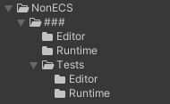
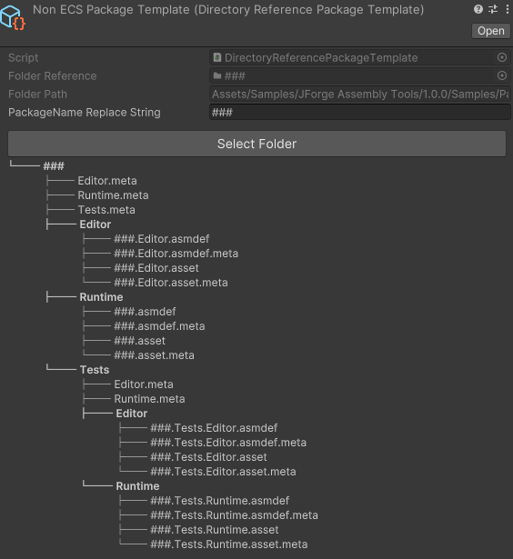
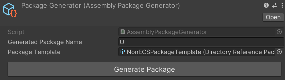

# Assembly Package Generator
## Summary
The Assembly Package Generator is a tool to generate feature packages from a template folder structure with assemblies and references.
## Using
* Set up a template folder structure with assemblies and references.
  * The template folder structure can use regular Assemblies, [Inherited Assembly Generator](Documentation~/InheritedAssemblyGenerator.md)s and any other project files.
  * Name files and folders with a replacement string e.g. "#" to later be replaced with a feature name.



* Create a **DirectoryReferencePackageTemplate** scriptable object in the project folder from **Create->JForge->DirectoryReferencePackageTemplate**
  * Click the "Select folder" button to set the correct template folder.
  * Set the replacement string



* Create a AssemblyPackageGenerator **Create->JForge->AssemblyPackageGenerator** in the parent folder of where you want to create the package
  * Set the feature name and target template
* Click the "Generate" button to create the package.




## Advanced
* If you want to create new types of custom templates akin to **DirectoryReferencePackageTemplate** you can inherit the **PackageTemplate** scriptable object.
* If you want to support custom assets being copied that requires post processing you can implement the **IAssetPackageGeneratorAssetPostProcessor** which will be picked up by reflection.

## Generating outside the Editor
Unlike **InheritedAssemblyGenerator**, package generation was never triggered automatically by editing the asset - it's always been an explicit, one-shot action fired by clicking the Inspector's "Generate Package" button. `AssemblyPackageGeneratorUtility` gives that action a programmatic entry point, for a repo where an AI coding agent or another tool has configured an **AssemblyPackageGenerator** by file and needs to actually run it, without a human clicking the button.

**Important:** this action is not safe to rerun blindly on an already-generated feature - see the warning in the skill below. Unlike regenerating an inherited assembly, it deletes and replaces any existing file at a path the template produces, with no diff or confirmation, so rerunning it against a hand-edited feature destroys those edits.

To run it:
* In the Editor: select the **AssemblyPackageGenerator** asset in the Project window, right-click → **JForge > AssemblyTools > Generate Package** (or use its Inspector's "Generate Package" button, unchanged).
* Programmatically, from anything that can run C# in the live Editor (e.g. a Unity Editor MCP/tool bridge):
  ```csharp
  JForge.AssemblyTools.PackageGenerator.AssemblyPackageGeneratorUtility.GeneratePackage("<path to the AssemblyPackageGenerator asset>");
  ```
* From the command line, CI, or when no such bridge is available:
  ```
  <Unity executable> -batchmode -nographics -projectPath <path> -executeMethod JForge.AssemblyTools.PackageGenerator.AssemblyPackageGeneratorUtility.GeneratePackageFromCommandLine -jforgeTarget "<path to the AssemblyPackageGenerator asset>" -quit
  ```

### For AI coding agents
The package ships an [AI Assistant skill](https://docs.unity3d.com/Packages/com.unity.ai.assistant@2.18/manual/skills/skills-filesystem.html) with these exact instructions - including the overwrite-risk warning above - at `AIAssistantSkills/generate-package/SKILL.md`. As with the [regenerate-inherited-assemblies](InheritedAssemblyGenerator.md#for-ai-coding-agents) skill, this is discovered automatically by Unity's own AI Assistant with no install step; other agent tools may need pointing at the file directly.