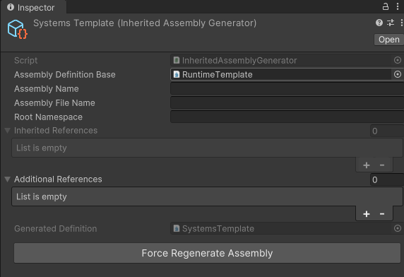

# Inherited Assembly Generator
## Summary
The Inherited Assembly Generator is a tool to generate inherited assemblies from assembly definition. This can be useful when you have a lot of assemblies to create or manage, where a project is undergoing constant changes that result in package dependencies changes over time. As unity does not support any inspector or other tooling for assemblies, these generators are a way to allow better reusability and maintainability of assemblies.
## Using
* Create a normal assembly definition which will be used as the base assembly.
    * Modify the assembly with dependencies or target platforms as needed.
* Create a InheritedAssemblyGenerator **Create->JForge->InheritedAssemblyGenerator** in the folder of where you want your new assembly.
  * Set the base assembly definition.
  * Add any additional dependencies & adjust names if you do not want to keep the same naming as the created **InheritedAssemblyGenerator**.
* An assembly will be generated when any changes are made to the **InheritedAssemblyGenerator**.
* (optional) Create additional **InheritedAssemblyGenerator**s to target the generated assembly to create inherited hierarchies.

