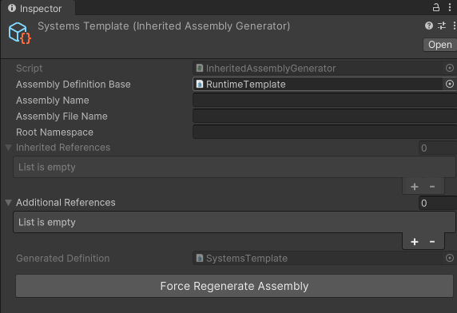

# Inherited Assembly Generator
## Summary
The Inherited Assembly Generator is a tool to generate inherited assemblies from assembly definition. This can be useful when you have a lot of assemblies to create or manage, where a project is undergoing constant changes that result in package dependencies changes over time. As unity does not support any inspector or other tooling for assemblies, these generators are a way to allow better reusability and maintainability of assemblies.
## Using
* Create a normal assembly definition which will be used as the base assembly.
    * Modify the assembly with dependencies or target platforms as needed.
* Create a InheritedAssemblyGenerator **Create->JForge->InheritedAssemblyGenerator** in the folder of where you want your new assembly.
  * Set the base assembly definition.
  * Add any additional dependencies & adjust names if you do not want to keep the same naming as the created **InheritedAssemblyGenerator**.
* An assembly will be generated when any changes are made to the **InheritedAssemblyGenerator**.
* (optional) Create additional **InheritedAssemblyGenerator**s to target the generated assembly to create inherited hierarchies.



## Regenerating outside the Editor
Editing a base assembly or an **InheritedAssemblyGenerator** asset directly - e.g. with a text editor, another tool, or an AI coding agent - does not trigger regeneration. Only edits made through the Unity Inspector do, since regeneration is driven by Unity's `OnValidate`, which only fires for Inspector-driven changes, not external file edits.

To regenerate just the generator(s) affected by a specific file you changed (fast - does not touch unrelated generators):
* In the Editor: select the changed file (either the `InheritedAssemblyGenerator` or the base `.asmdef`) in the Project window, right-click → **JForge > AssemblyTools > Regenerate Inherited Assembly**.
* Programmatically, from anything that can run C# in the live Editor (e.g. a Unity Editor MCP/tool bridge) - preferred over the command line below when available, since it works whether or not the Editor is open and needs no process management:
  ```csharp
  JForge.AssemblyTools.Inheritance.InheritedAssemblyGeneratorUtility.RegenerateTarget("<path to the changed file>");
  ```
* From the command line, CI, or when no such bridge is available:
  ```
  <Unity executable> -batchmode -nographics -projectPath <path> -executeMethod JForge.AssemblyTools.Inheritance.InheritedAssemblyGeneratorUtility.RegenerateTargetFromCommandLine -jforgeTarget "<path to the changed file>" -quit
  ```
  (Command-line only: if a Unity Editor is already open on the project, a second instance can't acquire the lock and this will just fail - use the Editor menu item or a live-Editor bridge instead in that case.)

  In both forms, the target may be either an `InheritedAssemblyGenerator` asset (resolved directly) or an assembly definition used as some generator's `assemblyDefinitionBase` (every generator using it as a base is regenerated).

To regenerate everything in the project instead (e.g. if you're not sure what changed, or want the whole project verified) - noticeably more expensive, since every generator in the project runs regardless of relevance:
* In the Editor: **JForge > AssemblyTools > Regenerate All Inherited Assemblies**.
* Programmatically: `InheritedAssemblyGeneratorUtility.RegenerateAll()`.
* From the command line: same pattern as above with `-executeMethod JForge.AssemblyTools.Inheritance.InheritedAssemblyGeneratorUtility.RegenerateAll` and no `-jforgeTarget` argument.

All entry points repeat passes as needed so a change propagates through an inheritance chain (e.g. Gen1 → Gen2 → Gen3).

### For AI coding agents
The package ships an [AI Assistant skill](https://docs.unity3d.com/Packages/com.unity.ai.assistant@2.18/manual/skills/skills-filesystem.html) with these exact instructions - including how to prefer a live-Editor bridge over the command line, and when a manual step is genuinely unavoidable (no bridge available *and* the Editor is already open) - at `AIAssistantSkills/regenerate-inherited-assemblies/SKILL.md`. This is Unity's documented convention for package-provided skills, so it's discovered automatically without any install step. It currently covers discovery by Unity's own AI Assistant; other agent tools (e.g. Claude Code) may not scan `Packages/*/AIAssistantSkills` themselves, so if you're using one of those, point it at this file directly or copy it into that tool's own skill location.